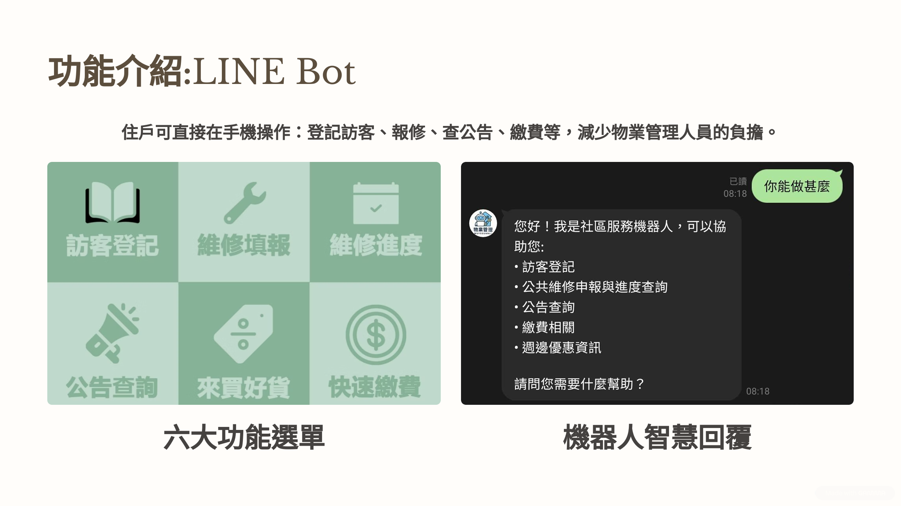

# 🚀 WuyeGuanliAI-LINE-BOT

基於LINE平台的智能社區服務機器人，整合 Azure AI Language 服務，提供社區居民便捷的服務體驗。


## 🔗 試玩連結

### 🤖 使用 LINE 官方帳號掃描下方的 QR Code 加入 LINE 好友：


1. ⚠️ 由於伺服器為 Railway 的免費層級，有時會延遲，請見諒
2. 📊 訓練集數據來源僅不足 80 筆，訓練效果可能較差（無法識別意圖，可接入完整的語言模型，如 GPT-4），實際使用時，請將可能會遇到的問題加入訓練集，以提高服務的品質

---

WuyeGuanli AI-LINE-BOT 為我們的協作專案 WuyeGuanli 物業管理系統的一部份：

- [前台](https://github.com/chikenouo/Wuyeguanli-vue-?tab=readme-ov-file)
- [後台](https://github.com/noveres/WuyeGuanli_NG)
- [後端](https://github.com/chikenouo/WuyeGuanli)

## 📝 專案介紹

本專案是一個智能社區服務 LINE 機器人，旨在為社區居民提供便捷的服務體驗。機器人利用 Azure AI Language 服務進行自然語言理解，能夠識別用戶意圖並提供相應的服務，包括訪客登記、公共維修申報、維修進度查詢、公告查詢、繳費相關和週邊優惠資訊等功能。

## 💡 功能特點



| 功能名稱          | 功能描述                                                                |
| ----------------- | ----------------------------------------------------------------------- |
| 🤖 自然語言理解   | 整合 Azure AI Language 服務，能夠理解用戶的自然語言輸入，識別意圖和實體 |
| 📝 訪客登記       | 提供線上訪客登記功能，減輕管理人員負擔                                  |
| 🛠️ 公共維修申報 | 居民可以報告公共設施問題，系統會自動分類並處理                          |
| 🔍 維修進度查詢   | 查詢已申報維修事項的處理進度                                            |
| 📢 公告查詢       | 查看社區最新公告                                                        |
| 💰 繳費相關       | 提供繳費通道和相關資訊                                                  |
| 🏷️ 週邊優惠資訊 | 提供社區周邊商家的優惠資訊                                              |

## 📚 教學資源

這份專案參考了以下教學資源：

| 資源名稱                               | 資源連結                                                                           | 詳細描述                                                                                                 |
| -------------------------------------- | ---------------------------------------------------------------------------------- | -------------------------------------------------------------------------------------------------------- |
| 📖 LINE Developers 官方文檔            | [連結](https://developers.line.biz/en/docs/messaging-api/line-bot-sdk/#official-sdks) | LINE Messaging API SDKs                                                                                  |
| 🐍 Python Package Index - LINE Bot SDK | [連結](https://pypi.org/project/line-bot-sdk/)                                        | LINE Messaging API SDKs 的 Python 套件倉庫                                                               |
| 🎓 大數據與人工智慧教學頻道            | [連結](https://www.youtube.com/@bigdatantue)                                          | 提供 AI 相關技術教學與實作指南，這個老師的教學非常詳細，推薦給有興趣的人學習，這個項目很多是基於他的內容 |

## 🏗️ 技術架構

| 技術名稱        | 版本/描述                       |
| --------------- | ------------------------------- |
| 🐍 後端框架     | Flask                           |
| 💬 LINE SDK     | line-bot-sdk 3.7                |
| 🤖 AI 服務      | Azure AI Language Conversations |
| 🔑 環境變數管理 | python-dotenv                   |

## ⚙️ 安裝步驟

1. ⬇️ 克隆專案到本地

```bash
git clone <repository-url>
cd AI-LINE-BOT
```

2. 📦 安裝依賴套件

```bash
pip install -r requirements.txt
```

3. 🗝️ 設置環境變數

創建一個 `.env` 文件，包含以下內容：

```plaintext
CHANNEL_ACCESS_TOKEN = 'your-line-channel-access-token'
CHANNEL_SECRET = 'your-line-channel-secret'
AZURE_LANGUAGE_ENDPOINT = 'your-azure-language-endpoint'
AZURE_LANGUAGE_KEY = 'your-azure-language-key'
```

## 🖥️ 環境配置

### 💬 LINE Bot 設置

1. 在 [LINE Developers](https://developers.line.biz/) 創建一個 Provider 和 Channel
   - 登入 LINE Developers 平台
   - 點擊「Create a new provider」，輸入 Provider 名稱
   - 在 Provider 頁面中，點擊「Create a Messaging API channel」
   - 填寫頻道基本資訊，包括頻道名稱、頻道描述、頻道圖示等
   - 同意條款並創建頻道
2. 獲取 Channel Access Token 和 Channel Secret
   - 在頻道基本設定頁面，可以找到 Channel Secret
   - 在 Messaging API 設定頁面，點擊「Issue」按鈕獲取 Channel Access Token
   - 將這些資訊保存到 `.env` 文件中
3. 設置 Webhook URL
   - 在 Messaging API 設定頁面，設置 Webhook URL 為 `https://your-domain/callback`
   - 啟用「Use webhook」選項
   - 可以使用 ngrok 等工具在本地開發時創建臨時的公開 URL
   - 點擊「Verify」按鈕測試 Webhook 連接是否成功
4. 設置 Rich Menu（選擇性）
   **方法一**
   - 在 Rich Menu 設定頁面，可以創建自定義的 Rich Menu
   - 上傳 Rich Menu 圖片，設置區域和動作
   - 啟用 Rich Menu 並設為默認
   - 需要先針對選單進行一些基本設定，例如標題（僅後台管理用）、使用期間等
   - 接著設定圖文選單的版型，有多種版型可供選擇，例如六格的大型版型
   - 上傳一張作為整體背景的圖片
     **方法二（本專案的方法）**
   - 使用 MessengerAPIblob 這個類別來操作 Rich Menu 相關的功能
   - 設定圖文選單的區域 (areas)，這是一個陣列，裡面要放入 RichMenuArea 物件
   - 每一個 RichMenuArea 物件需要設定 bounds（使用 RichMenuBounds 物件給定 XY 座標、寬度和高度）以及 action（點擊這個區域後要觸發的動作）
   - 要建立一個 RichMenuRequest 物件，這個物件需要設定 Rich Menu 的大小 (size，使用 RichMenuSize 物件設定寬度和高度)、預設是否顯示 (selected，設定 true 為顯示，false 為隱藏)、名稱 (name，僅後台管理用)、選單下方顯示的文字 (chatBarText)，以及剛剛設定 (areas)
   - 建立 RichMenuRequest 物件後，您可以使用 `line_bot_api.create_rich_menu()` 這個方法來建立 Rich Menu，並取得這次建立的 Rich Menu ID
   - 設定 Rich Menu 的圖片。使用 `with open(...)` as f: 的方式讀取您的圖片檔案
   - 使用 `line_bot_api_blob.set_rich_menu_image(rich_menu_id, content_type='image/jpeg', body=f)` 這個方法來設定圖片。請注意 content_type 需要根據您的圖片格式進行設定
   - 您需要設定預設 Rich Menu，可以使用 `line_bot_api.set_default_rich_menu(rich_menu_id)` 這個方法，將您剛剛建立的 Rich Menu ID 設定為預設

### ☁️ Azure AI Language 設置

1. 在 [Azure Portal](https://portal.azure.com/) 創建 Azure AI Language 資源
   - 登入 Azure Portal
   - 點擊「Create a resource」，搜索「Language Service」
   - 選擇「Language Service」，點擊「Create」
   - 填寫必要資訊，包括訂閱、資源組、區域、名稱等
   - 選擇定價層（可以選擇免費 F0 層級開始）
   - 點擊「Review + create」，然後點擊「Create」
2. 創建對話式語言理解專案
   - 在 Azure AI Language Studio (https://language.cognitive.azure.com/) 登入
   - 選擇剛才創建的資源
   - 在「Conversational language understanding」部分，點擊「Create new project」
   - 填寫專案名稱、描述和語言（繁體中文）
3. 設置意圖和實體
   - 在專案中，點擊「Build schema」
   - 添加意圖：點擊「Add」，輸入意圖名稱（如 visitor_registration）
   - 添加實體：點擊「Entities」標籤，添加實體（如 facility_type）
   - 參考 `4.json` 中的訓練數據，添加對應的意圖和實體
   - 為每個意圖添加示例語句，並標記其中的實體
     
     
4. 訓練並部署模型
   - 完成意圖和實體設置後，點擊「Train」按鈕
   - 訓練完成後，點擊「Deploy」按鈕
   - 創建一個部署名稱，然後點擊「Deploy」
5. 獲取端點和 API 金鑰
   - 部署完成後，點擊「Get prediction URL」
   - 複製端點 URL 和 API 金鑰
   - 將這些資訊保存到 `.env` 文件中

### 💻 本地開發環境設置

1. 🐍 安裝 Python（建議 3.13 或更高版本）
   - 從 [Python 官網](https://www.python.org/downloads/) 下載並安裝 Python
   - 確保將 Python 添加到 PATH 環境變數中
2. 🏗️ 虛擬環境配置
   **Windows 系統**
   ```bash
   # 創建虛擬環境
   python -m venv libot
   # 切換到 Scripts 目錄
   cd libot\Scripts
   # 啟動虛擬環境
   activate
   ```

   **虛擬環境使用說明**- 啟動成功後，命令提示字元前會出現 (libot)
   - 在虛擬環境中安裝的套件不會影響全域 Python 環境
   - 退出虛擬環境請使用 `deactivate` 命令
     **常見問題解決**
   - 如果無法執行 activate，請確認 Python 是否已加入 PATH
   - Windows 執行權限問題可使用：`Set-ExecutionPolicy RemoteSigned -Scope CurrentUser`
   - 建議每個專案使用獨立的虛擬環境，避免套件版本衝突
3. 📦 安裝依賴套件
   ```bash
   pip install -r requirements.txt
   ```
4. 🗝️ 設置環境變數
   - 創建 `.env` 文件，填入所有必要的 API 金鑰和設置
   - 確保 `.gitignore` 文件中包含 `.env`，避免敏感資訊被提交到版本控制系統

## 🚀 使用方法

### 🖥️ 本地開發

```bash
python app.py
```

### ☁️ 部署到伺服器

本專案可以部署到支持 Python 的任何伺服器平台，如 Heroku、Railway 等。

## 🧠 意圖和實體

當前機器人能夠識別以下意圖和實體（此處請依照自己的需求去 [Language Studio](https://language.cognitive.azure.com/home) 訓練）

### 🎯 意圖列表

| 意圖名稱                | 描述         |
| ----------------------- | ------------ |
| 📝 visitor_registration | 訪客登記相關 |
| 🛠️ maintenance        | 公共維修相關 |
| 🔍 maintenance_status   | 維修進度查詢 |
| 📢 announcement         | 公告查詢     |
| 💰 payment              | 繳費相關     |
| 🏷️ nearby_discount    | 週邊優惠     |
| 🆘 help                 | 幫助         |
| 🙋 greeting             | 問候         |

### 🏷️ 實體列表

| 實體名稱          | 描述                          |
| ----------------- | ----------------------------- |
| 🏢 facility_type  | 設施類型（如電梯、燈具等）    |
| 📍 location       | 位置（如 A 棟、地下停車場等） |
| ⚠️ issue_type   | 問題類型（如故障、漏水等）    |
| 🕒 time_reference | 時間參考（如今天、明天等）    |
| 🆘 help_topic     | 幫助主題                      |
| 👀 user_concern   | 用戶關注點                    |

## 🤝 貢獻指南

使用上有任何困難或建議，歡迎[聯繫我](https://mail.google.com/mail/?view=cm&to=andrew901117@gmail.com)，我會盡可能地提供幫助或改善
如果您有任何問題或建議，請在 GitHub 上創建一個 issue。如果您願意貢獻代碼，請 fork 這個專案，提交您的更改，然後創建一個 pull request。

## ⚠️ 注意事項

- 請確保 `.env` 文件中的敏感資訊不被公開
- 定期更新 Azure AI Language 模型以提高識別準確率
